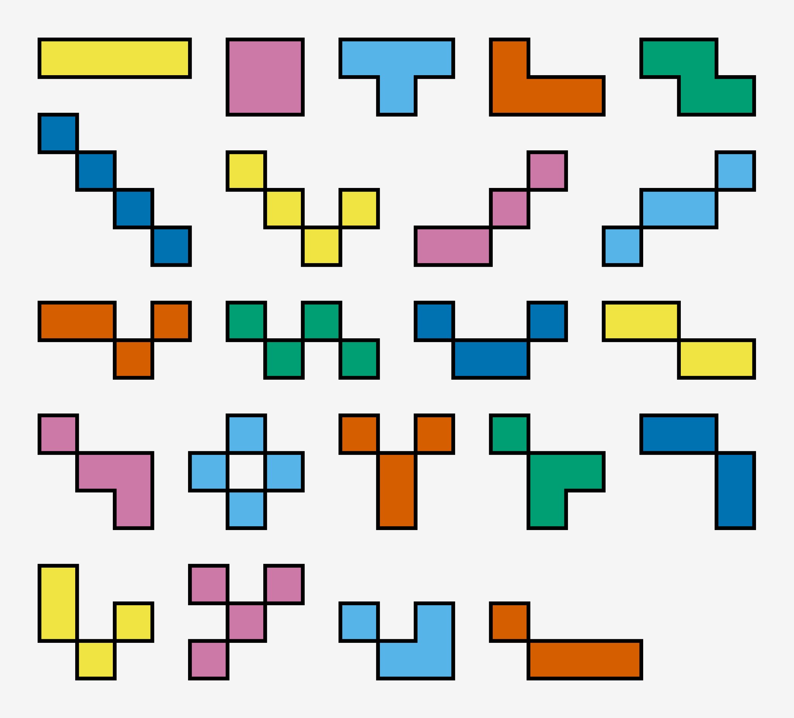

# Tetris Game Compiler

This README provides information and specifications on the custom tetris compiler. Following is the directory structure:
```
tetrisV4.1
│
├── lexer.l
├── parser.y
├── engine.py
├── Makefile
├── code1.tetris
├── code2.tetris
├── code3.tetris
```
The complete parser code can be found in [parser.y](./parser.y), the lexer in [lexer.l](./lexer.l) and the python game engine in [engine.py](./engine.py)
The testcases and sample .tetris programs (some with orchestrated errors for demonstration of error handling) to test the code can be found in the directory [testcases](./testcases/)

## Setup

This tetris compiler uses a custom engine built in python. The template has been taken from [this GitHub Repo](https://gist.github.com/timurbakibayev/1f683d34487362b0f36280989c80960c). **This implementation uses pygame so kindly install it via one of the options:**

```bash
make install
[OR]
pip3 install pygame
```

After this run make to compile our custom compiler:

```bash
make
[alternatively]
bison -dy -v parser.y
gcc lex.yy.c y.tab.c -o tetris
```
This should create the following files:

```
tetrisV4.1
│
├── lex.yy.c
├── y.tab.c
├── y.tab.h
├── y.output
└── ....
```

One can see the complete grammar with state, transitions and shift-reduce rules in [y.output](./y.output)

## A2 Grammar
The following presents the A2 grammar provided by RPJ sir, with a slight modification of the `return` keyword in the functions. Also note that I have used the simple CFG for arithmetic logic. This grammar would have been ambiguous (and given shift-reduce conflicts) but I have used the `%left` and `%right` precedence operators ([parser.y](./parser.y)) to make this grammar unambiguous.

$$
\begin{align*}
&\text{START} \rightarrow \text{Section1 newline PRIMITIVE Section2 newline FUNCTIONS Section3 ENGINE} \\
&\text{PRIMITIVE} \rightarrow \text{id=EXPR newline PRIMITIVE | } \varepsilon \\
&\text{FUNCTIONS} \rightarrow \text{FUNCTION newline FUNCTIONS | } \varepsilon \\
&\text{FUNCTION} \rightarrow \text{\{id BODY\} | \{id BODY return ID\}} \\
&\text{BODY} \rightarrow \text{STATEMENT BODY | STATEMENT} \\
&\text{STATEMENT} \rightarrow \text{IFSTATEMENT | WHILELOOP | id = EXPR} \\
&\text{IFSTATEMENT} \rightarrow \text{if ( EXPR ) then STATEMENT end | if ( EXPR ) then STATEMENT else STATEMENT end} \\
&\text{WHILELOOP} \rightarrow \text{while ( EXPR ) STATEMENT end} \\
&\text{EXPR} \rightarrow \text{ARITHLOGIC | [call id] | [call id with PARAM PARAMLIST]} \\
&\text{ARITHLOGIC} \rightarrow \text{INTEGER | ID | ARITHLOGIC + ARITHLOGIC | ARITHLOGIC - ARITHLOGIC | ARITHLOGIC * ARITHLOGIC} \\
&\text{\ \ \ \ \ \ \ \ \ \ \ \ \ \ \ \ \ \ \ \ \ \ \ \ \ \ \ \ \ \ \ \ } \text{| ARITHLOGIC / ARITHLOGIC | (ARITHLOGIC) | - ARITHLOGIC} \\
&\text{PARAM} \rightarrow \text{id = EXPR} \\
&\text{PARAMLIST} \rightarrow \text{PARAM PARAMLIST | } \varepsilon \\
\end{align*}
$$


## Tetrominoe Types
The following image shows the types of blocks in our tetris:




## Program Specifications and Features:

The following are some of the many features that a programmer can exploit to run their own custom tetris game:

1. **grid size**: The programmer can set the `height` and `width` of the tetris board. The zoom and screen size are automatically adjusted to give a smooth UI experience. The default value if `height=40` and `width=20`
2. **level**: The programmer can set the `baselevel` a.k.a the starting level of the game. The higher the `level` the faster the pices move down on the grid. The default value is `baselevel = 2`
3. **levelup**: This partameter decides when the levelp must occur. For example setting it to 5 whould mean that when the `score` reaches 5 the level will be incremented by 1. The default value is `levelup=1`
4. **type of tetrominoes**: There are 2 types of tetrominoes avialbale to the player - the standard connected tetrominoes (connected at the edges) and the extetetrominoes (connected at te corners). this gives rise to 3 `choice` of tetris blocks:
    - `tetrominoes`: the standard edge connected tetrominoes
    - `extetrominoes`: the modified corner connected tetrominoes
    - `all`: combination of both; this is the default option
5. **probability distribution for pieces**: The `prob` parameter is applicable only when the `choice` is set to `all`. In this case `prob` will determine the probability with which extetrominoes are selected and `1-prob` determines the probability with which tetrominoes are selected. The default value is set to `0.1` since playing with the corner connected tetriminoes is difficult and often impossble to win
6. **color for blocks**: There are the following `color` choices available (the default is random to keep things fun!):
    - `red`
    - `black`
    - `mauve`
    - `green`
    - `purple`
    - `brown`
    - `teal`
    - `random`: this randomly selects the color for each block from the above choices
7. **randomised block appearance**: Each block appears at a random location (along the x coordinate) to make the game more fun!
8. Pressing escape will restart the game with easy parameters for beginniners.
9. There is Score tab on top that increments whenever a row completes. The score also decides the level using the `levelup` parameter. Additionally, users can restart the game anytime by pressing `escape` key or succumb to the `GAme Over` message on loosing!


## Let's Test!
Let us first test the [code1.tetris](./code1.tetris). This has an error! Section1 is repeated! Let us run it:
```bash
make test1
```
Thankfully our lexer catches that and displays the following error:
```
tetris: fatal error: Section1 repeated (line 3)
```

Now let us test [code2.tetris](./code2.tetris). 
```bash
make test2
```
This file has a few warning errors. Many variables are declared for the first time in Section2. We nevertheless compile the ocde and display the errors as warnings to the programmer for debugging:
```bash
tetris: name warning: name 'myfunc2' not defined
tetris: name warning: name 'y' not defined
tetris: name warning: name 'x' not defined
tetris: name warning: name 'x' not defined
tetris: name warning: name 'y' not defined
tetris: name warning: name 'x' not defined
tetris: name warning: name 'x' not defined, using as string
tetris: name warning: name 'x' not defined
tetris: name warning: name 'y' not defined
tetris: name warning: name 'x' not defined
```

Note how undeclared variables are converted to python strings:
```python
from engine import Tetris

# Section 1
num = 40
num2 = 10


# Section 2
def myfunc1():
	if 2:
		y = myfunc2()
		x = 9
	else:
		x = 2


def myfunc2():
	if 10:
		y = 10
		x = -9
	return x


def myfunc3():
	while 2:
		x = 'x' + 2
		y = myfunc2(x = 5)


def myfunc4():
	while 2:
		x = num2 + 2

# Section 3
game = Tetris(baselevel = 2 , height = 40 , width = 20)
game.run()

```

## Let's play!

Now let us compile and run a fully correct code and play the game of tetris:
```bash
make test3
```
This creates the following python file - [code3.py](./code3.py)
```python
from engine import Tetris

# Section 1
num = 40
h = 0
num2 = 20


# Section 2
def getlevel():
	num = 2
	return num


def getheight():
	if 10:
		h = 40
	return h

# Section 3
game = Tetris(baselevel = getlevel() , height = 40 , width = 20 , color = 'random' , levelup = 2 , choice = 'all' , prob = 20)
game.run()

```

**NOTE:** This file too gives some warnings which is the expected behaviour. The programmer is informed that random is converted to "random" and all is converted to "all". This is the expected behaviour of the code but might not be very obvious to a new A2 language programmer and is hence displayed:

```bash
tetris: name warning: name 'random' not defined, using as string
tetris: name warning: name 'all' not defined, using as string
```

# Enjoy playing Tetris!
Try making a `.tetris` yourself and enjoy this addictive and refreshing arcade game.

